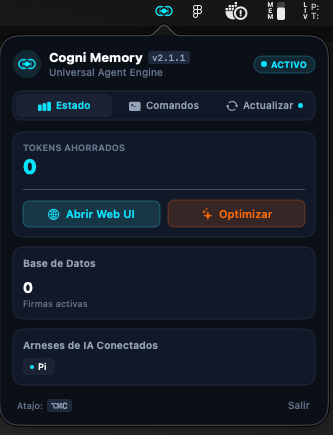

<p align="center">
  
</p>

<h1 align="center">Cogni</h1>

<p align="center">
  <b>Cognitive Omniscient Grid for Networked Intelligence</b><br>
  <i>Motor de memoria persistente de alto rendimiento para agentes de IA de código.</i>
</p>

<p align="center">
  <a href="https://golang.org/"></a>
  <a href="https://sqlite.org/"></a>
  <a href="https://developer.apple.com/"></a>
  <a href="LICENSE"></a>
  <a href="https://github.com/AdelysAlberto/cogni-memory"></a>
</p>

---

## Vision General

Cada vez que un agente de desarrollo reinicia una sesion o sufre una compactacion de contexto, olvida por completo los errores que ya resolvio, los acuerdos de arquitectura y las decisiones de librerias. El resultado es devastador: el modelo gasta entre 10.000 y 25.000 tokens de contexto leyendo archivos que no deberia volver a tocar, y quema entre 2.000 y 8.000 tokens de razonamiento intentando deducir de nuevo lo que ya estaba resuelto.

**Cogni** es una infraestructura local de memoria persistente en Go y SQLite FTS5 con clasificacion probabilistica BM25. En lugar de forzar a tu agente a releer codigo fuente o depender de complejas bases de datos vectoriales que fallan al buscar identificadores de codigo, Cogni entrega el razonamiento ya resuelto en menos de 40 tokens.

---

## Instalacion Rapida

El instalador detecta automaticamente tu sistema operativo (macOS / Linux / Windows) y tu arquitectura (`arm64`, `x86_64`, `amd64`).

<p align="center">
  <br>
  <sub>CogniBar residente en la barra de menús de macOS con indicador de estado, tokens ahorrados y comandos rápidos</sub>
</p>

### macOS (Apple Silicon M1/M2/M3/M4 e Intel)

Dispones de dos métodos de instalación:

#### Opción A: Descarga de Aplicación Nativa para Barra de Menús (Recomendado)
Software **Certificado y Notarizado por Apple** con firma de código Developer ID:

* **[Descargar CogniBar.dmg (macOS Universal)](https://github.com/AdelysAlberto/cogni-memory/releases/latest/download/CogniBar.dmg)**

Abre el archivo `.dmg` descargado y arrastra **CogniBar** a tu carpeta de **Aplicaciones**.

#### Opción B: Instalación por Terminal (CLI + Motor de Memoria)
```bash
bash <(curl -fsSL https://raw.githubusercontent.com/AdelysAlberto/cogni-memory/main/install.sh)
```

Para activar la aplicación residente en la barra de menús desde la terminal:
```bash
cogni bar
```

### Linux (Ubuntu, Debian, Fedora, Arch, Alpine en amd64 / arm64)

```bash
bash <(curl -fsSL https://raw.githubusercontent.com/AdelysAlberto/cogni-memory/main/install.sh)
```

### Windows (PowerShell / WSL)

En **PowerShell**:
```powershell
# Opción A: Instalación directa con Go (Recomendada)
go install github.com/AdelysAlberto/cogni/cmd/cogni@latest

# Opción B: Vía WSL (Windows Subsystem for Linux) / Git Bash
bash <(curl -fsSL https://raw.githubusercontent.com/AdelysAlberto/cogni-memory/main/install.sh)
```

### Compilación Manual desde Fuente (Go 1.22+)

```bash
git clone https://github.com/AdelysAlberto/cogni-memory.git cogni
cd cogni
make install
```

---

## Por Que Cogni es la Mejor Opcion para tu IA

El ecosistema de memoria para agentes esta lleno de soluciones que no funcionan en codigo real. Esta es la realidad tecnica de por que Cogni supera a las alternativas del mercado:

### 1. El Fracaso de las Bases de Datos Vectoriales en Entornos de Codigo
Las bases de datos vectoriales (`pgvector`, Chroma, Pinecone) calculan similitudes semanticas conceptuales ("la vibra del texto"). Pero en ingenieria de software, los problemas se definen por nombres exactos:
* Un vector no comprende con precision simbolos como `RCTModalHostViewController`, `useNearbyIncidents`, `app/_layout.tsx` o codigos de error especificos de un compilador.
* Requieren llamadas a APIs de embeddings remotas por cada consulta, introduciendo latencia de red (300ms a 1s) y costes continuos por token.
* **La Solucion Cogni**: Motor local en Go con SQLite FTS5 y algoritmo de clasificacion **BM25**. Busqueda lexico-fonetica con soporte de stems en sub-milisegundos (2ms), 100% offline, con cero costes de API y precision milimetrica en simbolos tecnicos.

### 2. Motor de Busqueda en Cascada (BM25 Cascade Engine)
Los sistemas tradicionales de FTS fallan cuando un agente busca frases largas con multiples palabras clave (conjunción estricta `AND`), devolviendo 0 resultados. Cogni implementa un pipeline de resolucion en cascada:
1. **Fase 1 (Exact Match)**: Coincidencia booleana estricta en el proyecto actual.
2. **Fase 2 (BM25 Disyuntivo Ponderado)**: Busqueda con operador `OR` sobre stems y clasificacion por relevancia probabilistica BM25, otorgando maximo peso a `topic_key` y `title`. Coincidencias con 3 de 5 palabras se posicionan arriba en vez de descartarse.
3. **Fase 3 (Cross-Project Fallback)**: Si el proyecto actual no contiene registros suficientes, recupera patrones arquitectonicos y soluciones aprendidas en otros proyectos del usuario.
4. **Fase 4 (Category Softening)**: Si el filtro de categoria era demasiado restrictivo, expande la busqueda manteniendo la relevancia tecnica.
5. **Fase 5 (Fuzzy LIKE)**: Fallback seguro ante cualquier anomalia sintactica.

### 3. Ahorro Real de Tokens y Razonamiento
* **Context Tokens**: Reemplaza lecturas de 500 lineas de codigo (2.500 tokens por archivo) por una previsualizacion compacta de 35 tokens en Fase 1 y una hidratacion selectiva de 120 tokens en Fase 2. Reduccion de contexto >95%.
* **Reasoning Tokens (Thinking Models)**: En modelos modernos con cadena de pensamiento (Claude 3.7 Thinking, Gemini Thinking, o1/o3-mini), un bug desconocido provoca exploracion de hipotesis de hasta 8.000 tokens de razonamiento. Cogni le entrega el invariante verificado y la receta exacta, reduciendo el gasto de pensamiento a menos de 300 tokens.

### 4. Integracion Idempotente y Cero Sobrescrituras
* **`mcp.json` Seguro**: Desmaterializa las configuraciones previas y solo registra o actualiza la clave `"cogni"`. Servidores de Postgres, Playwright, Pencil o notificadores externos jamas se pierden ni se alteran.
* **`AGENTS.md` Preservado**: Inyecta bloques delimitados (`<!-- cogni:protocol:start -->`) al final del archivo. Cero lineas de tus directivas previas resultan afectadas.

---

## CogniBar: Aplicacion Nativa para Barra de Menus (macOS)

Cogni incluye una aplicación nativa para la barra superior de macOS construida en Swift y SwiftUI (`macos/`):

* **Certificación Apple**: Firmada y notarizada oficialmente por Apple con certificado Developer ID.
* **Synapse Pulse**: El icono en la barra superior emite un destello reactivo en tiempo real cada vez que un agente de IA guarda o recupera una memoria (monitoreo a nivel de kernel mediante `FSEvents` con 0ms de retardo y cero consumo de CPU/batería).
* **Atajo Global (`⌥⌘C` / Option + Command + C)**: Abre el panel interactivo desde cualquier pantalla sin requerir permisos de accesibilidad.
* **Control Total y Comandos Rápidos**: Muestra los tokens ahorrados, estado de la base de datos, arneses conectados, pestaña de comandos útiles y un verificador de actualizaciones en tiempo real.

---

## Matriz de Arneses Soportados

Cogni detecta y configura automaticamente los principales entornos y arneses de IA del mercado:

| Arnés / Entorno | Soporte MCP | Soporte Skill (`SKILL.md`) | Inyección de Reglas | Inyección `AGENTS.md` | Ubicación Principal |
| :--- | :---: | :---: | :---: | :---: | :--- |
| **Pi Coding Agent (`pi.dev`)** | Si | Si | Si | Si | `~/.pi/agent/` |
| **Claude Code CLI** | Si | Si | Si | Si | `~/.claude/` / `~/.claude.json` |
| **Claude Desktop** | Si | Si | Si | No | `~/Library/Application Support/Claude/` |
| **Cursor IDE** | Si | No (vía MCP + Rules) | Si | No (vía rules) | `~/.cursor/` |
| **Gemini Antigravity** | Si | No (vía MCP + Rules) | Si | No (vía rules) | `~/.gemini/config/` |
| **OpenCode** | Si | Si | Si | Si | `~/.config/opencode/` |
| **GitHub Copilot (VS Code)** | No (vía CLI) | Si | Si | Instrucciones User | `~/.config/Code/User/prompts/` |
| **Hermes CLI** | Si | Si | Si | Si | `~/.hermes/` |
| **OpenAI Codex CLI** | Si (TOML) | Si | Si | Si | `~/.codex/` |
| **Workspace Local** | Si (`.agents/`) | Si (`.agents/skills/`) | Si (`.agents/rules/`) | Si (`./AGENTS.md`) | `./.agents/` |

---

## Formato de Almacenamiento: Machine-Actionable Engram

Cogni no almacena prosa conversacional para consumo humano; almacena firmas sinteticas de alta densidad optimizadas para que el LLM las ejecute directamente como invariantes de ingenieria:

### Formato A: Machine Engram (Bugs y Arquitectura)
```yaml
Topic: architecture/navigation/ios-modals
Summary: Trigger: Modal stacking error on iOS | Invariant: RCTModalHostViewController cannot stack modals | Recipe: Convert screens to Stack.Screen routes and use local CustomAlert inside modals | Antipattern: Never nest full screens inside <Modal>
```

### Formato B: Firma Sintetica Estandar
```yaml
Topic: standards/i18n/ui
Summary: What: Todo texto visible en TSX debe usar t('namespace:key') | Why: Estandar global de traduccion | Where: src/modules/*, src/layouts/* | Learned: Toast notifications tambien requieren internacionalizacion
```

---

## Configuracion de Arneses de IA

Al ejecutar `cogni init`, dispones de un selector interactivo en terminal con filtrado en tiempo real:

```bash
# Selector interactivo TUI (escribe para filtrar y navega con flechas)
cogni init

# Configurar para un arnés específico de forma directa
cogni init --harness pi          # Pi Coding Agent (pi.dev)
cogni init --harness antigravity # Gemini Antigravity
cogni init --harness cursor      # Cursor IDE
cogni init --harness claude      # Claude Code / Desktop
cogni init --harness opencode    # OpenCode
cogni init --harness copilot     # GitHub Copilot

# Configurar en todos los arneses detectados en el sistema
cogni init --all
```

---

## Herramientas MCP Nativas

Al conectarse via Model Context Protocol, el agente dispone de las siguientes capacidades:

* **`cogni_search(query, project, category, all_projects, limit)`**: Busqueda compacta con clasificacion BM25 y desborde entre proyectos. Devuelve ID, TopicKey, titulo y resumen en ~35 tokens por resultado.
* **`cogni_get(id, topic_key, project)`**: Hidratacion completa del registro seleccionado en Fase 2.
* **`cogni_save(title, summary, what, why, where, learned, category, tags, topic_key, project, global)`**: Guardado estructurado o upsert automatico si el `topic_key` ya existe.
* **`cogni_update(id, title, summary, category, tags, topic_key)`**: Actualizacion puntual de registros por ID.
* **`cogni_context(project, limit)`**: Recuperacion instantanea de hitos recientes y convenciones activas al arrancar sesion o tras compactacion (<100 tokens).
* **`cogni_session_summary(goal, accomplished, discoveries, next_steps, relevant_files)`**: Persistencia de progreso al finalizar sesion o tras compactacion.
* **`cogni_stats()`**: Auditoria de salud de memoria y tokens reales ahorrados.

---

## Referencia de Comandos CLI

```bash
# 1. Recuperar contexto activo reciente (< 100 tokens)
cogni context

# 2. Buscar memorias con el motor BM25 Cascade
cogni search --query "modal crash viara navigation"

# 3. Guardar un Machine Engram estructurado
cogni save \
  --topic-key "arch/nav/modal-stacking" \
  --title "iOS Modal Stacking Fix and Screen Navigation" \
  --what "Migracion de modales a Stack.Screen routes" \
  --why "RCTModalHostViewController no apila modales en iOS" \
  --where "app/_layout.tsx, app/viara.tsx" \
  --learned "Modales nativos requieren su propio CustomAlert" \
  --category "architecture" \
  --tags "ios,modal,navigation,uikit"

# 4. Obtener detalle completo de una memoria
cogni get arch/nav/modal-stacking
cogni get --id 96

# 5. Abrir la app de la barra de menús / Bandeja
cogni bar

# 6. Lanzar la interfaz gráfica en el navegador
cogni ui

# 7. Estadísticas de memoria y tokens ahorrados
cogni stats

# 8. Actualización atómica resiliente
cogni upgrade
```

---

## Stack Tecnologico y Arquitectura

* **Lenguaje**: Go 1.22+ (Compilacion estatica, binario ligero, sin runtimes externos).
* **Almacenamiento**: SQLite embebido en modo WAL (`PRAGMA synchronous = NORMAL`, `busy_timeout = 5000`).
* **Indice Full-Text**: SQLite FTS5 con tabla virtual `memories_fts` sincronizada mediante triggers automaticos de insercion, borrado y actualizacion.
* **Ranking**: Algoritmo BM25 nativo ponderado por columnas (`bm25(memories_fts, 5.0, 10.0, 2.0, 5.0)`).
* **Protocolo de Agentes**: Servidor MCP nativo sobre transporte stdio (JSON-RPC 2.0).
* **Web UI**: Dashboard local embebido en el binario via `embed.FS` con servidor HTTP interno.

---

## Estructura del Repositorio

```text
cogni-memory/
├── cmd/cogni/main.go          # Punto de entrada de la CLI
├── internal/
│   ├── cli/                   # Handlers de comandos CLI e instalacion de arneses
│   ├── core/                  # Entidades de dominio, resolucion de proyectos y directivas
│   ├── mcp/                   # Servidor MCP stdio con protocolo JSON-RPC 2.0
│   ├── server/                # Servidor HTTP embebido y endpoints REST para Web UI
│   └── storage/               # Motor SQLite FTS5, BM25 Cascade y persistencia
├── web/                       # Assets estaticos embebidos (Dashboard Web UI)
├── SKILL.md                   # Definicion canonica de la Skill para agentes
├── Makefile                   # Tareas de compilacion, testing e instalacion
├── release.sh                 # Automatizacion de releases
└── install.sh                 # Script universal de despliegue multi-arnés
```

---

## Licencia

Distribuido bajo licencia **MIT**. Consulta el archivo [LICENSE](LICENSE) para mas detalles.
